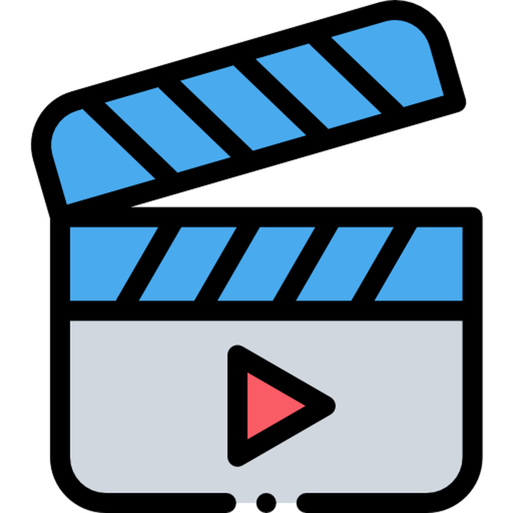

# Vidlyzer



**Vidlyzer** is a cutting-edge iOS application designed to analyze video content comprehensively. Leveraging the power of OpenAI's APIs, Vidlyzer transcribes audio from videos, detects offensive content, assesses sentiment, and provides detailed summaries. Whether you're a content creator, educator, or anyone keen on understanding the nuances of video content, Vidlyzer offers invaluable insights to enhance your media experience.

---

## 📋 Table of Contents

- [Features](#features)
- [Screenshots](#screenshots)
- [Getting Started](#getting-started)
  - [Prerequisites](#prerequisites)
  - [Installation](#installation)
  - [Setting Up OpenAI API Key](#setting-up-openai-api-key)
- [Usage](#usage)
- [Contributing](#contributing)
- [License](#license)
- [Contact](#contact)

---

## 🎉 Features

- **Video Playback with Controls**
  - Seamless playback of videos with standard controls.
  - Display of video duration for quick reference.

- **Audio Transcription**
  - Converts spoken words in videos to text using OpenAI's Whisper API.
  - Scrollable and editable transcription view.

- **Content Moderation**
  - Detects offensive language, hate speech, and self-harm related content.
  - Highlights offensive words directly within the transcription.

- **Sentiment Analysis**
  - Assesses the overall sentiment of the video content as Positive, Negative, or Neutral.
  - Visual representation using emojis and color-coded labels.

- **Flagged Issues Summary**
  - Comprehensive list of detected issues, including offensive words and unusual pauses.
  - Interactive elements allowing navigation to specific timestamps in the video upon selection.

- **Interactive UI Elements**
  - Bottom sheet modal to display full transcription.
  - Responsive design with rounded corners and intuitive layout.

- **User Actions**
  - **Reupload Video:** Easily upload a new video for analysis.
  - **Save Analysis:** Store analysis results locally using Core Data for future reference.

---

## 📷 Screenshots

> **Note:** Replace the placeholder images with actual screenshots of your app.


*Home Screen displaying video playback and analysis summary.*


*Scrollable transcription with highlighted offensive words.*


*List of flagged issues with types, descriptions, and timestamps.*


*Sentiment analysis section displaying overall sentiment with emojis.*

---

## 🚀 Getting Started

Follow these instructions to set up and run Vidlyzer on your local machine for development and testing purposes.

### 🛠 Prerequisites

- **Xcode:** Version 14.0 or later.
- **iOS Deployment Target:** iOS 15.0 or higher.
- **Swift:** Swift 5.5 or later.
- **OpenAI API Key:** Required to access OpenAI's transcription and moderation services.

### 📥 Installation

1. **Clone the Repository**

   ```bash
   git clone https://github.com/yourusername/Vidlyzer.git
   ```

2. **Navigate to the Project Directory**

   ```bash
   cd Vidlyzer
   ```

3. **Open the Project in Xcode**

   ```bash
   open Vidlyzer.xcodeproj
   ```

4. **Install Dependencies**

   Vidlyzer uses built-in frameworks and does not rely on external dependencies. Ensure all required frameworks are available in your Xcode environment.

### 🔑 Setting Up OpenAI API Key

Vidlyzer utilizes OpenAI's APIs for transcription and content moderation. To set up your API key:

1. **Obtain an API Key**

   - Sign up or log in to your [OpenAI account](https://platform.openai.com/).
   - Navigate to the API section and generate a new API key.

2. **Configure the API Key in Vidlyzer**

   - Open `Constants.swift` located in the project directory.
   - Replace the placeholder with your actual OpenAI API key:

     ```swift
     struct Constants {
         static let openAIAPIKey = "YOUR_OPENAI_API_KEY_HERE"
     }
     ```

   > **Security Note:** For production builds, ensure that API keys are securely stored and not hardcoded.

---

## 🖥 Usage

Using Vidlyzer is straightforward. Follow these steps to analyze your videos:

1. **Launch Vidlyzer**

   Open the Vidlyzer app on your iOS device.

2. **Upload a Video**

   - Tap the "Upload Video" button.
   - Select a video from your photo library or record a new one using the camera.

3. **Wait for Analysis**

   - The app will extract audio from the video, transcribe it, and perform content moderation and sentiment analysis.
   - A loading indicator will display the progress.

4. **View Analysis Results**

   - **Video Playback:** Play, pause, and navigate through the video.
   - **Duration:** View the total duration of the video.
   - **Transcription:** Scroll through the transcribed text with offensive words highlighted.
   - **Flagged Issues:** Review a list of detected issues, including offensive language and unusual pauses.
   - **Sentiment Analysis:** See the overall sentiment of the video content represented with emojis.

5. **Interact with Analysis**

   - **Navigate to Timestamps:** Tap on any flagged issue to jump to the specific timestamp in the video.
   - **View Full Transcription:** Tap on the transcription preview to open a detailed view in a bottom sheet.
   - **Reupload or Save Analysis:**
     - **Reupload Video:** Upload a new video for analysis.
     - **Save Analysis:** Store the current analysis results locally for future reference.

6. **Access Saved Analyses**

   - Navigate to the "Saved Analyses" section to review previously analyzed videos and their corresponding insights.

---

## 🤝 Contributing

Contributions are what make the open-source community such an amazing place to learn, inspire, and create. Any contributions you make are **greatly appreciated**.

1. **Fork the Project**

   Click the "Fork" button at the top right of this repository.

2. **Create Your Feature Branch**

   ```bash
   git checkout -b feature/AmazingFeature
   ```

3. **Commit Your Changes**

   ```bash
   git commit -m "Add some AmazingFeature"
   ```

4. **Push to the Branch**

   ```bash
   git push origin feature/AmazingFeature
   ```

5. **Open a Pull Request**

   Go to the original repository and click "New Pull Request."

---

## 📝 License

Distributed under the MIT License. See `LICENSE` for more information.

---

## 📞 Contact

- **Shivansh Gaur**
- **Email:** shivanshgaur96@gamil.com
- **GitHub:** [@ShivanshGaur6096](https://github.com/ShivanshGaur6096)

---

## 🛡 Acknowledgements

- [OpenAI](https://openai.com/) for providing powerful APIs for transcription and content moderation.
- [Apple Developer](https://developer.apple.com/) for the robust iOS development frameworks.
- [Design Inspiration](https://dribbble.com/) for the UI/UX design ideas.

---

## 🔗 Useful Links

- [OpenAI API Documentation](https://platform.openai.com/docs/api-reference/introduction)
- [Swift Documentation](https://swift.org/documentation/)
- [AVFoundation Framework](https://developer.apple.com/documentation/avfoundation)
- [GitHub Guides](https://guides.github.com/)

---

> **Note:** This README is a template and should be customized to fit the specific details and assets of your Vidlyzer project. Ensure all links, images, and contact information are accurately updated.
